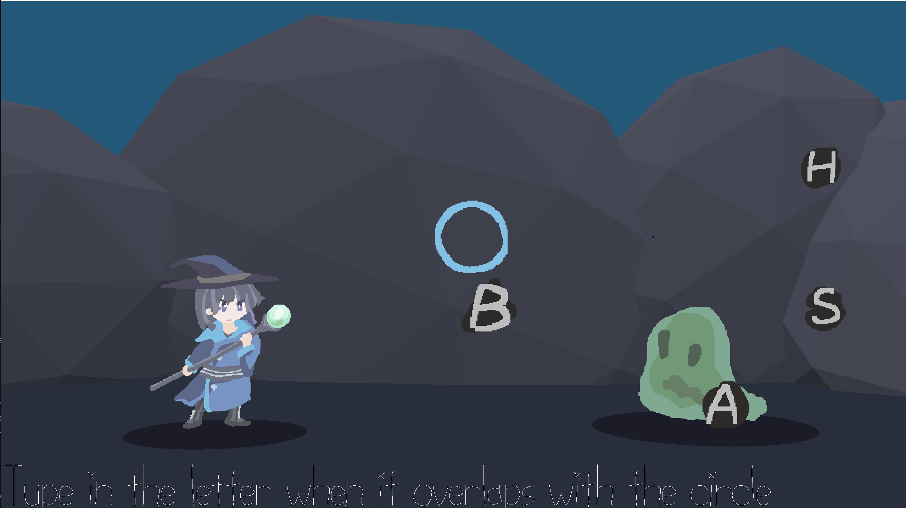

# Incantyper

**Author**: Runkun Chen (runkunc)

A typing rhythm game, inspired by *PaRappa the Rapper* and typing games; mixing both into a somewhat novel (but not that novel) game design.

You are a mage fighting a slime. But to cast magic, you have to spell out words in sync with some rhythm.

**Screenshot**:

**How To Play**:

- Use keyboard to type in letters;
- when the letter overlaps with the circle in the center, hit the key;
- the more precise the better;
- the music alternates between two instrumental parts with the exact same rhythm. So try follow it.

**Known issues**:
- Game will automatically start; to replay, please restart the program.
- If the OS is unstable (dropping a lot of frames at once), then some notes will disappear, and keys will become desynchronized.

-----

3D assets created in Blender.
2D assets drawn in Aseprite.
Music composed in GarageBand, with Vital for synths.
Word list partially taken from Dictionary.com.

This game was built with [NEST](NEST.md).
